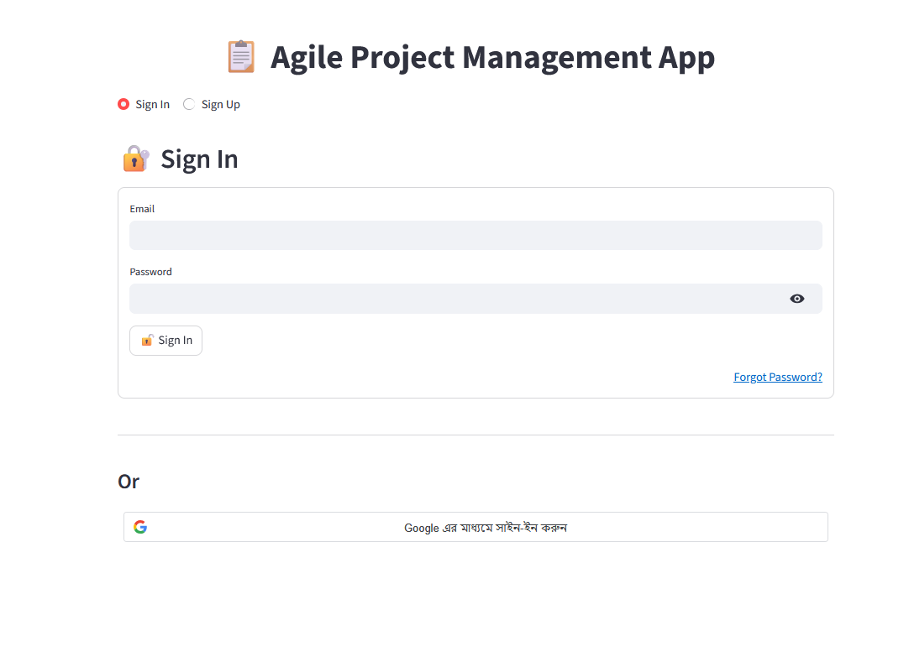
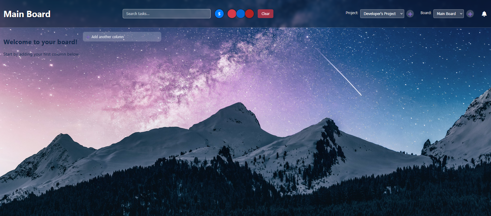
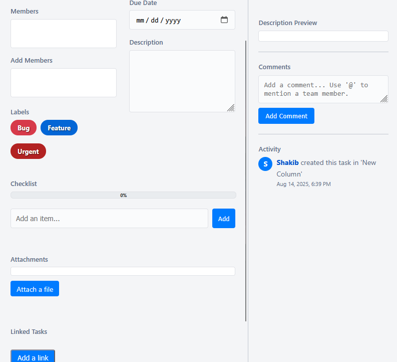

# Agile Project Management App - Landing Page

This repository is a landing page created to showcase the features of our core **Agile Project Management Application**. This landing page serves as a demo of the core application built using Streamlit and Flask.

The main objective is to showcase the functionality, design, and practical experience of our core project to users or clients.

<!-- [🔗 Check out the live demo](#####################) -->

---

## ✨ Key Project Features

Below are the key features of our Agile Management Tool, as showcased on this landing page:

### 👤User & Organization Management
*   **Secure Authentication:** Secure sign-up and sign-in via email and password (with Bcrypt hashing).

*   **Two-Factor Authentication (2FA):** Additional security based on an OTP sent to email during login.
*   **Password Reset:** Secure password reset facility through the "Forgot Password" feature.
*   **Google OAuth 2.0:** Fast and secure sign-in/sign-up using Google Account.
* **Admin Approval System:** Ability to accept or reject requests from new users to join the organization.

### 📋Interactive Kanban Board
*   **Real-time Collaboration:** Using WebSockets (Socket.IO), any changes to the board (task moves, comments) are instantly updated to all users.
*   **Project and Board Management:** Facility to create multiple projects under the organization and multiple Kanban boards under each project.
*   **Drag and Drop:** Easily move tasks from one column to another.
* **Column and Task CRUD:** Admins can create, rename, and delete columns, and members can create tasks.

### 📝 Detailed Task View
* **Rich Text:** Format task descriptions and comments with Markdown support.
* **Checklists and Progress:** Create checklists under tasks and track their progress.
* **File Attachment:** Ability to upload any file with the task.
* **Labels and Assignees:** Tagging tasks with different labels (e.g. Bug, Feature) and assigning them to team members.
* **Task linking:** Linking one task to another (`blocks`, `relates to`, `duplicates`).
* **Activity log:** View a complete history of all changes to a task.

### 💬Collaboration & Notifications
* **Real-time commenting and @ mentions:** Mention other members using `@` in comments, which sends them email notifications.
* **Real-time notifications:** An integrated notification system for task assignments or mentions.

---

## 📸 Screenshots

(You can add some nice screenshots of your application here. This will make your project more attractive.)

---

## 🛠️ Technology Stack

| Category | Technology |
| :--- | :--- |
| ** Frontend ** | Streamlit, HTML5, CSS3, JavaScript, Socket.IO Client |
| ** Backend ** | Python, Flask, Flask-SocketIO |
| ** Database ** | MySQL |
| ** Caching/Messaging **| Redis |
| ** Libraries ** | SQLAlchemy, Bcrypt, Gunicorn, Gevent, python-dotenv |

---